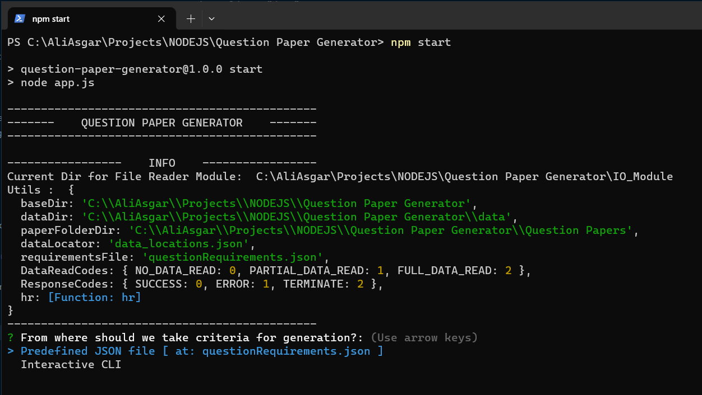
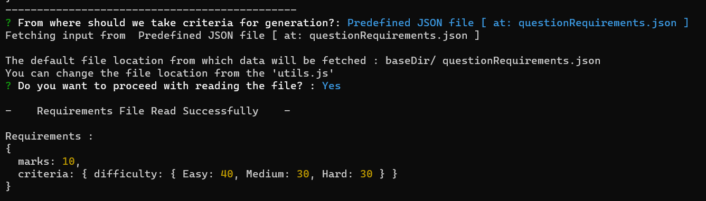
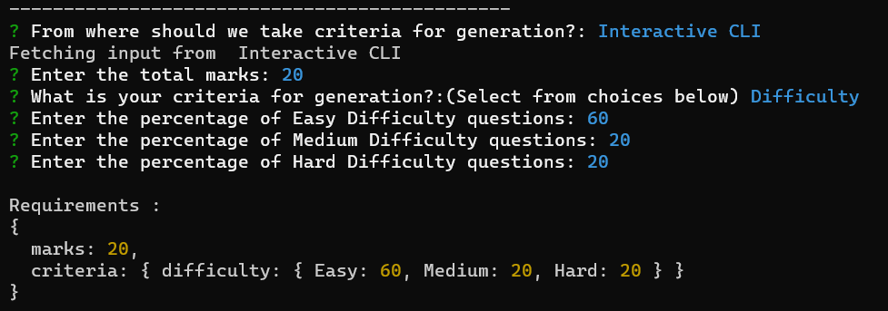
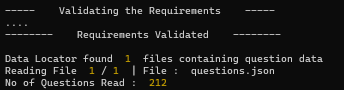
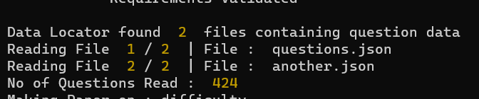
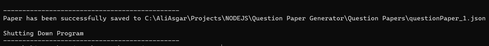

<h1 align="center">Welcome to Question Paper Generator 👋</h1>
<p>
  
  <a href="https://spongy01.github.io/Question-Paper-Generator/" target="_blank">
    
  </a>
</p>


> This project, part of Reelo's backend internship evaluation, creates a Question Paper Generator. It takes the total marks and difficulty distribution as input to generate a custom question paper.

***
***

## Pre-reqs
Node.js is required for this project.

***
***

## Install

```sh
$ git clone https://github.com/Spongy01/Question-Paper-Generator.git
$ cd Question-Paper-Generator
$ npm install
```
<br>

***
***
## Things To Know Before You Run:

### File Directory Structure
```bash
.
└── Question Paper Generator/
    ├── data/
    │   └── questions.json
    ├── IO_Module/
    │   ├── file_reader.js
    │   ├── paperWriter.js
    │   └── requirementFetcher.js
    ├── Generator/
    │   ├── questionGenerator.js
    │   └── questionManager.js
    ├── Validator/
    │   └── validator.js
    ├── tests/
    │   ├── questionGenerator.test.js
    │   ├── questionManager.test.js
    │   └── validator.test.js
    ├── app.js
    ├── utils.js
    ├── data_locations.json
    ├── jsdoc.config.json
    ├── package.json
    ├── package-lock.json
    ├── questionRequirements.json
    └── README.md
```

### Understanding the Main Structure

#### `data/` :
Default directory to store question data in `.json` files. Add multiple files and include them in data_locations.json to make them accessible. Update the default data folder from utils.js file's dataDir variable.

#### `IO_module/`, `Validator/`, `Generator/` :
These folders contain the main logic of the application.

- `IO_Module/` handles reading question store, fetching requirements from the user and writing question paper in a json file in the default output directory.

- `Validator/` handles validation tasks regarding the requirements received from the user.

- `Generator/` is concerned with generating question paper from the validated requirements.


#### `data_locations.json` :
The File Reader Module fetches file names from this file to read questions from the data/ directory. Modify this file to include new files or exclude files you don't want to read.
```javascript
---example---
data_directory:
data/
  ├── another.json
  ├── thirdOne.json
  └── questions.json

data_locations.json :
{
    "locations" : ["questions.json", "another.json" ] 
       // only the files mentioned here will be read when reading the question store.
}
// because thirdOne.json was not in "locations" array, it will not be read
// this gives user much freedom of selecting question stores 
// when there are multiple question stores available 
```
If you have another file which holds this data and you want to use that, you can update the utils.js dataLocator variable to the relative path of your file from the base directory. 

#### `app.js` 
Starting point containing the driver code. Executed when you run the application.

### The Most Important Thing : `utils.js` 
[Documentation for `utils.js`](https://spongy01.github.io/Question-Paper-Generator/module-Utils.html) <br>
[`utils.js` raw code](https://github.com/Spongy01/Question-Paper-Generator/blob/main/utils.js)


This file contains configurations related to various files. You can configure it before running the program to re-define the locations of important files and folders. Defaults are already set but update if you modify file structures.


### The Second Most Important Thing : `Requirements Object`
Two ways to generate a question paper: an interactive CLI or `questionRequirements.json` file. When reading from the file, it is important to note that the format of requirements should be as below:
```json
 {
   marks : 10,
   criteria : {
     difficulty : { 
       Easy: 40,
       Medium: 30,
       Hard: 30,
     }
     // can add more criteria here 
   }
 }
```
If the `validator.js` cannot properly validate the requirements, it may result in inaccurate outcomes. The default file location for these requirements is set within `utils.js`, allowing you to update it if your requirements are stored in a different file.

------------------
Now you can go run this XD

***
***


## Usage
To start the application, from the root dir of  the project execute:
```sh
npm start
```


You will be met with two options to fetch requirements : Interactive CLI or a predefined JSON file (currently reading from default `questionRequirements.json` ) . You can update the JSON file or give path to a new JSON file in `utils.js`.

### Reading from JSON


The requirements will be read from the file

### Reading from CLI


The requirements will be read from the interactive CLI


Once the input is read, it undergoes a validation process to determine its feasibility.

If the requirements pass validation, the file reader module will retrieve the question store from the files defined in the dataLocator variable within utils.js (by default, the file used is data_locations.json).






In case of successful file reading (in situations where multiple files are present and some might be unreadable, the process continues but returns a partial data read status, issuing a warning), the system proceeds to generate the question paper. The resulting paper is stored in the default output paper directory, also configurable within `utils.js`.



If you execute this application multiple times, each generated paper will be stored with a distinct file name to prevent overwriting existing papers.

***
***

## Run tests
As humans, we're prone to making mistakes even in the simplest of tasks. Therefore, a comprehensive set of tests has been created within the tests\ folder to simulate various successful and unsuccessful conditions in both the question generation process and input validation. These tests aim to demonstrate the behavior of the code under different scenarios. <br> To execute all tests, use the following command:
```sh
npm test
```
<br>
To run tests for a specific file, you can use the following command:

```sh
npm test -- <filename.test.js>
```
<br>

***
***
## My Reflections
This project was an incredible learning journey for me. I've always believed in learning through hands-on experiences, and this project was a perfect example.

### My First Times and Learnings:
- **Documentation** : Used JSDocs. Great functionality but the base template was mehh. Came to know about docdash theme, liked it better, used it. I am still exploring more on customizing documentation.
- **Testing** : This was my initial attempt at writing tests. While I'm not entirely satisfied with them, it was a valuable learning experience. Used Jest as the testing framework.
- **Node.js** : This is my first time diving deep into Node.js. My prior exposure to it was during an online course on Blockchain, where it was used to connect React with Web3. Back then, Node.js wasn't my focus, and I followed along without fully grasping its workings. This project was a good experience in understanding Node.js better, and I've come to appreciate its capabilities. However, I believe there's still a lot more to explore and learn within this ecosystem.

### Insights:
- The `utils.js` file in this project was inspired by Django's `settings.py`. In Django, crucial editable declarations, such as database configurations and paths, are stored in `settings.py`, offering a centralized way to manage these settings. Similarly, I designed `utils.js` to declare significant locations like input/output directories. Any alterations made in `utils.js` are reflected universally, eliminating hassles associated with updating multiple locations.
- The core task of generating questions intriguingly resembles a variation of the subsetSum problem.

### Future Additions to the Project:
- **Interactive CLI for configuring utils.js** :  Implementing an interactive CLI for users to update configuration files like utils.js would streamline the process and reduce manual editing errors.

- **User-Defined Question Paper Names** : Including functionality for users to name question papers themselves would add a personal touch and enhance usability.
<br>

***
***
## Author

👤 **Ali Asgar Padaria**

* Github: [@Spongy01](https://github.com/Spongy01)
* LinkedIn: [@https:\/\/www.linkedin.com\/in\/ali-asgar-padaria-467512218\/](https://linkedin.com/in\/ali-asgar-padaria-467512218\/)

## Show your support

Give a ⭐️ if this project helped you!

***